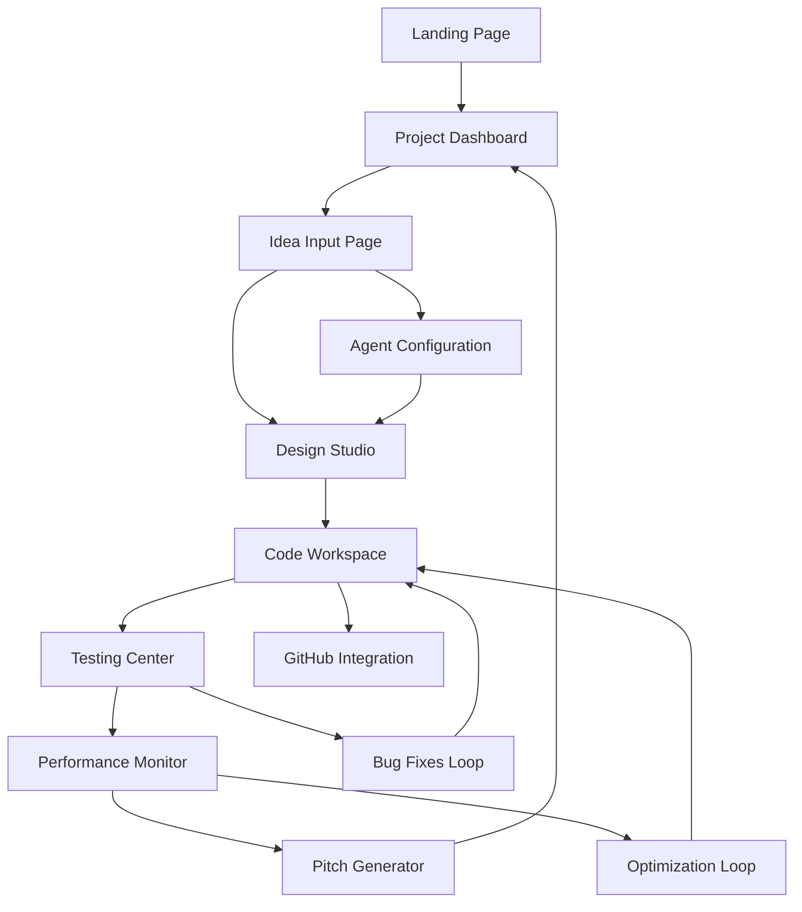

# IdeaToApp - Product Requirements Document

## 1. Product Overview
IdeaToApp is an AI-powered web application that transforms natural language ideas into fully functional, tested, and optimized web applications through automated multi-agent orchestration.
- Solves the problem of complex development workflows by automating design, coding, testing, and deployment processes for non-technical users and rapid prototyping.
- Target market includes entrepreneurs, designers, product managers, and hackathon participants who need to quickly validate and build digital products.

## 2. Core Features

### 2.1 User Roles
| Role | Registration Method | Core Permissions |
|------|---------------------|------------------|
| Creator | Email registration with GitHub OAuth | Can create projects, manage AI agents, access all features |
| Viewer | Invitation-based access | Can view project progress, test applications, provide feedback |
| Admin | System-level access | Full platform management, usage analytics, agent configuration |

### 2.2 Feature Module
Our IdeaToApp platform consists of the following main pages:
1. **Landing Page**: hero section with demo, feature showcase, pricing tiers
2. **Project Dashboard**: active projects list, agent status monitoring, resource usage
3. **Idea Input Page**: natural language processor, project configuration, AI agent selection
4. **Design Studio**: Figma integration, design inspiration gallery, wireframe preview
5. **Code Workspace**: live code editor, GitHub sync status, build logs
6. **Testing Center**: TestSprite integration, test results, bug reports
7. **Performance Monitor**: CoreSpeed analytics, optimization suggestions, before/after metrics
8. **Pitch Generator**: DeckSpeed integration, slide customization, presentation export

### 2.3 Page Details
| Page Name | Module Name | Feature description |
|-----------|-------------|---------------------|
| Landing Page | Hero Section | Display value proposition with interactive demo showcasing idea-to-app transformation |
| Landing Page | Feature Showcase | Present AI agent capabilities with visual workflow diagrams and success stories |
| Landing Page | Pricing Tiers | Show subscription plans with usage limits and feature access levels |
| Project Dashboard | Project List | Display active/completed projects with status indicators and quick actions |
| Project Dashboard | Agent Monitor | Real-time status of AI agents (Figma MCP, SOLO, TestSprite, CoreSpeed) with health metrics |
| Project Dashboard | Resource Usage | Show API calls, build minutes, storage usage with billing information |
| Idea Input Page | Natural Language Processor | Accept user descriptions with smart suggestions and requirement extraction |
| Idea Input Page | Project Configuration | Set project name, target platform, technology preferences, deployment options |
| Idea Input Page | Agent Selection | Choose which AI agents to activate with customization options |
| Design Studio | Figma Integration | Connect to Figma workspace, import/export designs, component library access |
| Design Studio | Inspiration Gallery | Browser Use agent results with curated design patterns and UI components |
| Design Studio | Wireframe Preview | Live preview of generated wireframes with editing capabilities |
| Code Workspace | Live Code Editor | Real-time code generation with syntax highlighting and collaborative editing |
| Code Workspace | GitHub Sync | Automatic repository creation, commit tracking, branch management |
| Code Workspace | Build Logs | Display compilation status, error messages, deployment progress |
| Testing Center | TestSprite Integration | Automated test generation, execution results, coverage reports |
| Testing Center | Bug Reports | Issue tracking with AI-suggested fixes and priority scoring |
| Testing Center | Test Configuration | Customize test scenarios, browser targets, performance benchmarks |
| Performance Monitor | CoreSpeed Analytics | Real-time performance metrics with historical trends and alerts |
| Performance Monitor | Optimization Engine | AI-generated suggestions for caching, compression, lazy loading |
| Performance Monitor | Metrics Dashboard | Before/after performance scores with detailed breakdowns |
| Pitch Generator | DeckSpeed Integration | Auto-generate presentation slides from project data and GitHub README |
| Pitch Generator | Slide Customization | Edit content, themes, layouts with brand customization options |
| Pitch Generator | Export Options | Download as PDF, PowerPoint, or share via link with analytics |

## 3. Core Process

**Main User Flow:**
1. User registers and accesses the Project Dashboard
2. User navigates to Idea Input Page and describes their application concept
3. System processes natural language and suggests project configuration
4. AI agents are activated in sequence: Browser Use → Figma MCP → Trae SOLO → GitHub MCP
5. User monitors progress in Design Studio and Code Workspace
6. TestSprite automatically generates and runs tests, reports results in Testing Center
7. CoreSpeed monitors performance and provides optimization suggestions
8. DeckSpeed generates pitch deck available in Pitch Generator
9. User can iterate, deploy, or share the completed application

## 4. User Interface Design

### 4.1 Design Style
- **Primary Colors:** Deep blue (#1a365d) for trust and professionalism, bright green (#38a169) for success states
- **Secondary Colors:** Light gray (#f7fafc) for backgrounds, orange (#ed8936) for warnings and highlights
- **Button Style:** Rounded corners (8px radius) with subtle shadows and hover animations
- **Typography:** Inter font family, 16px base size for body text, 24px+ for headings
- **Layout Style:** Card-based design with clean spacing, top navigation with breadcrumbs
- **Icons:** Outline style with 2px stroke weight, consistent sizing at 20px/24px

### 4.2 Page Design Overview
| Page Name | Module Name | UI Elements |
|-----------|-------------|-------------|
| Landing Page | Hero Section | Full-width gradient background, centered CTA button, animated code preview |
| Project Dashboard | Agent Monitor | Status cards with color-coded indicators, progress bars, real-time updates |
| Idea Input Page | Natural Language Processor | Large textarea with smart autocomplete, floating action buttons |
| Design Studio | Wireframe Preview | Split-screen layout, zoomable canvas, floating toolbar |
| Code Workspace | Live Code Editor | Dark theme editor, collapsible sidebar, tabbed interface |
| Testing Center | Test Results | Table view with expandable rows, filter controls, export buttons |
| Performance Monitor | Metrics Dashboard | Chart.js visualizations, metric cards, comparison sliders |
| Pitch Generator | Slide Editor | Drag-and-drop interface, theme selector, preview pane |

### 4.3 Responsiveness
Desktop-first responsive design with mobile breakpoints at 768px and 1024px. Touch-optimized interactions for mobile devices with gesture support for canvas-based components. Progressive web app capabilities for offline access to project data.
