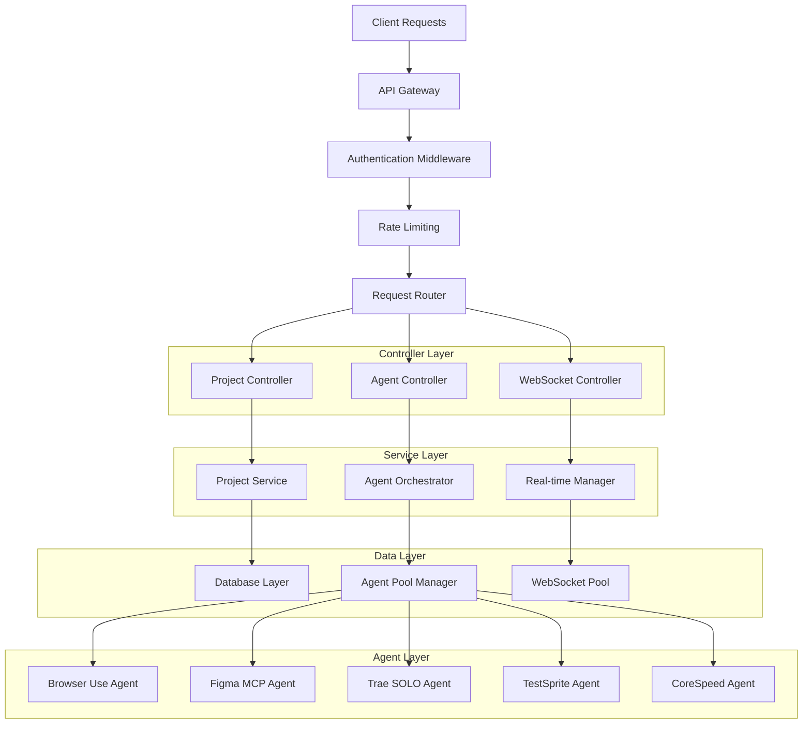
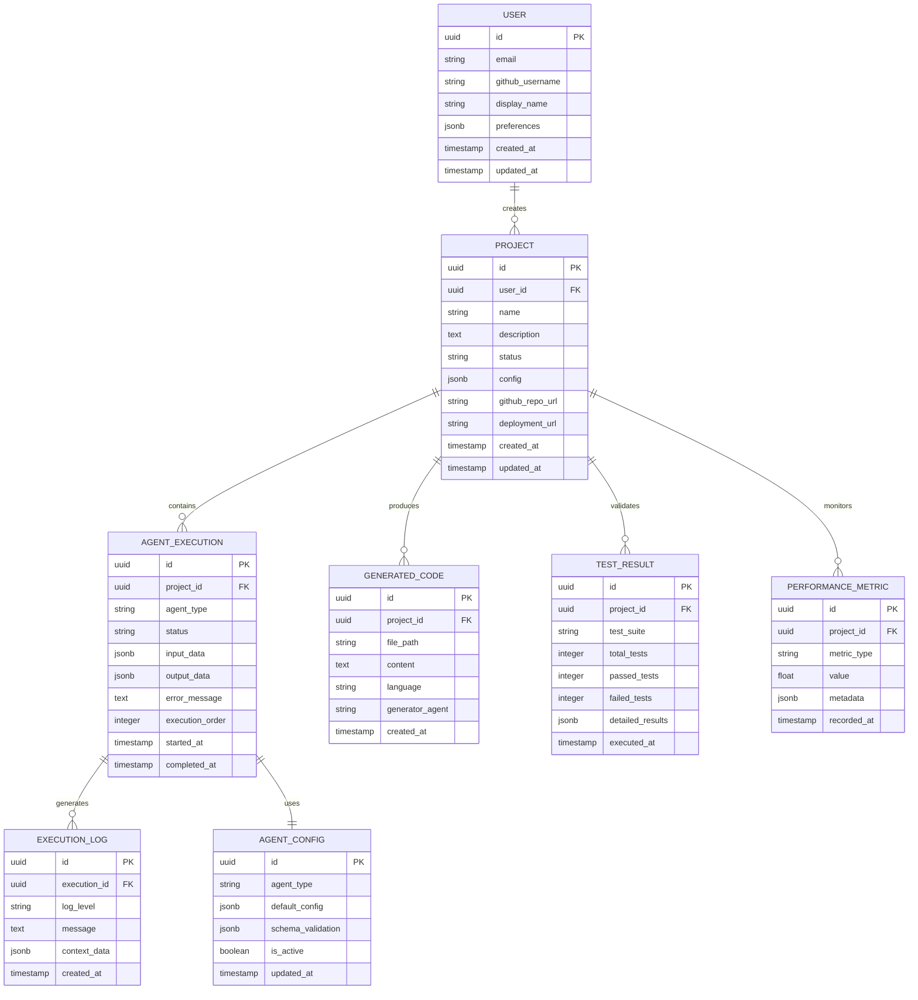

# IdeaToApp - Technical Architecture Document

## 1. Architecture Design

```mermaid
graph TD
    A[User Browser] --> B[React Frontend Application]
    B --> C[API Gateway / Load Balancer]
    C --> D[Multi-Agent Orchestrator]
    
    D --> E[Browser Use Agent]
    D --> F[Figma MCP Server]
    D --> G[Trae SOLO Agent]
    D --> H[GitHub MCP Server]
    D --> I[TestSprite Agent]
    D --> J[CoreSpeed Agent]
    D --> K[DeckSpeed Agent]
    
    E --> L[Design Inspiration API]
    F --> M[Figma API]
    G --> N[Code Generation Engine]
    H --> O[GitHub API]
    I --> P[Testing Infrastructure]
    J --> Q[Performance Monitoring]
    K --> R[Presentation Generator]
    
    D --> S[Message Queue (Redis)]
    D --> T[WebSocket Manager]
    D --> U[Supabase Database]
    
    subgraph "Frontend Layer"
        B
    end
    
    subgraph "API Layer"
        C
        D
    end
    
    subgraph "AI Agent Layer"
        E
        F
        G
        H
        I
        J
        K
    end
    
    subgraph "External Services"
        L
        M
        O
    end
    
    subgraph "Infrastructure Layer"
        S
        T
        U
        N
        P
        Q
        R
    end
```

## 2. Technology Description
- Frontend: React@18 + TypeScript + TailwindCSS@3 + Vite + Zustand
- Backend: Node.js + Express@4 + TypeScript + Socket.io
- Database: Supabase (PostgreSQL) + Redis Cache
- AI Integration: OpenAI GPT-4 + Anthropic Claude + Custom MCP Servers
- Infrastructure: Docker + Kubernetes + GitHub Actions CI/CD

## 3. Route Definitions
| Route | Purpose |
|-------|---------|
| / | Landing page with product showcase and registration |
| /dashboard | Main project dashboard with agent status monitoring |
| /project/new | Idea input form with natural language processing |
| /project/:id | Individual project workspace with multi-tab interface |
| /project/:id/design | Design studio with Figma integration and inspiration gallery |
| /project/:id/code | Code workspace with live editor and GitHub sync |
| /project/:id/test | Testing center with TestSprite results and bug tracking |
| /project/:id/performance | Performance monitoring dashboard with CoreSpeed analytics |
| /project/:id/pitch | Pitch deck generator with DeckSpeed integration |
| /auth/login | User authentication with GitHub OAuth |
| /auth/callback | OAuth callback handler |
| /settings | User preferences and API key management |

## 4. API Definitions

### 4.1 Core API

**Project Management**
```
POST /api/projects
```
Request:
| Param Name | Param Type | isRequired | Description |
|------------|------------|------------|-------------|
| description | string | true | Natural language project description |
| name | string | true | Project display name |
| config | object | false | Agent configuration preferences |

Response:
| Param Name | Param Type | Description |
|------------|------------|-------------|
| projectId | string | Unique project identifier |
| status | string | Project creation status |
| agentPipeline | array | Ordered list of agents to execute |

**Agent Orchestration**
```
POST /api/agents/execute
```
Request:
| Param Name | Param Type | isRequired | Description |
|------------|------------|------------|-------------|
| projectId | string | true | Target project identifier |
| agentType | string | true | Agent to execute (browser-use, figma-mcp, trae-solo, etc.) |
| input | object | true | Agent-specific input parameters |
| dependencies | array | false | Required outputs from previous agents |

Response:
| Param Name | Param Type | Description |
|------------|------------|-------------|
| executionId | string | Unique execution identifier |
| status | string | Execution status (pending, running, completed, failed) |
| output | object | Agent execution results |
| nextAgent | string | Suggested next agent in pipeline |

**Real-time Updates**
```
WebSocket /ws/project/:id
```
Events:
- `agent_status_update`: Real-time agent execution progress
- `code_generation_progress`: Live code generation updates
- `test_results`: TestSprite execution results
- `performance_metrics`: CoreSpeed monitoring data

## 5. Server Architecture Diagram



## 6. Data Model

### 6.1 Data Model Definition



### 6.2 Data Definition Language

**User Table**
```sql
CREATE TABLE users (
    id UUID PRIMARY KEY DEFAULT gen_random_uuid(),
    email VARCHAR(255) UNIQUE NOT NULL,
    github_username VARCHAR(100),
    display_name VARCHAR(100) NOT NULL,
    preferences JSONB DEFAULT '{}',
    created_at TIMESTAMP WITH TIME ZONE DEFAULT NOW(),
    updated_at TIMESTAMP WITH TIME ZONE DEFAULT NOW()
);

CREATE INDEX idx_users_email ON users(email);
CREATE INDEX idx_users_github ON users(github_username);
```

**Project Table**
```sql
CREATE TABLE projects (
    id UUID PRIMARY KEY DEFAULT gen_random_uuid(),
    user_id UUID NOT NULL REFERENCES users(id) ON DELETE CASCADE,
    name VARCHAR(200) NOT NULL,
    description TEXT NOT NULL,
    status VARCHAR(50) DEFAULT 'initializing' CHECK (status IN ('initializing', 'designing', 'coding', 'testing', 'optimizing', 'completed', 'failed')),
    config JSONB DEFAULT '{}',
    github_repo_url VARCHAR(500),
    deployment_url VARCHAR(500),
    created_at TIMESTAMP WITH TIME ZONE DEFAULT NOW(),
    updated_at TIMESTAMP WITH TIME ZONE DEFAULT NOW()
);

CREATE INDEX idx_projects_user_id ON projects(user_id);
CREATE INDEX idx_projects_status ON projects(status);
CREATE INDEX idx_projects_created_at ON projects(created_at DESC);
```

**Agent Execution Table**
```sql
CREATE TABLE agent_executions (
    id UUID PRIMARY KEY DEFAULT gen_random_uuid(),
    project_id UUID NOT NULL REFERENCES projects(id) ON DELETE CASCADE,
    agent_type VARCHAR(50) NOT NULL CHECK (agent_type IN ('browser-use', 'figma-mcp', 'trae-solo', 'github-mcp', 'testsprite', 'corespeed', 'deckspeed')),
    status VARCHAR(50) DEFAULT 'pending' CHECK (status IN ('pending', 'running', 'completed', 'failed', 'cancelled')),
    input_data JSONB NOT NULL DEFAULT '{}',
    output_data JSONB DEFAULT '{}',
    error_message TEXT,
    execution_order INTEGER NOT NULL,
    started_at TIMESTAMP WITH TIME ZONE,
    completed_at TIMESTAMP WITH TIME ZONE
);

CREATE INDEX idx_agent_executions_project_id ON agent_executions(project_id);
CREATE INDEX idx_agent_executions_status ON agent_executions(status);
CREATE INDEX idx_agent_executions_order ON agent_executions(project_id, execution_order);
```

**Generated Code Table**
```sql
CREATE TABLE generated_code (
    id UUID PRIMARY KEY DEFAULT gen_random_uuid(),
    project_id UUID NOT NULL REFERENCES projects(id) ON DELETE CASCADE,
    file_path VARCHAR(500) NOT NULL,
    content TEXT NOT NULL,
    language VARCHAR(50) NOT NULL,
    generator_agent VARCHAR(50) NOT NULL,
    created_at TIMESTAMP WITH TIME ZONE DEFAULT NOW()
);

CREATE INDEX idx_generated_code_project_id ON generated_code(project_id);
CREATE INDEX idx_generated_code_language ON generated_code(language);
```

**Initial Data**
```sql
INSERT INTO agent_config (agent_type, default_config, schema_validation, is_active) VALUES
('browser-use', '{"search_engines": ["google", "dribbble", "behance"], "max_results": 10}', '{"type": "object", "properties": {"query": {"type": "string"}}}', true),
('figma-mcp', '{"workspace_id": null, "component_library": "default"}', '{"type": "object", "properties": {"design_brief": {"type": "string"}}}', true),
('trae-solo', '{"framework": "react", "backend": "node", "database": "supabase"}', '{"type": "object", "properties": {"requirements": {"type": "array"}}}', true),
('testsprite', '{"test_types": ["unit", "integration", "e2e"], "browsers": ["chrome", "firefox"]}', '{"type": "object", "properties": {"codebase_path": {"type": "string"}}}', true),
('corespeed', '{"metrics": ["lcp", "fid", "cls"], "monitoring_interval": 300}', '{"type": "object", "properties": {"app_url": {"type": "string"}}}', true);
```
