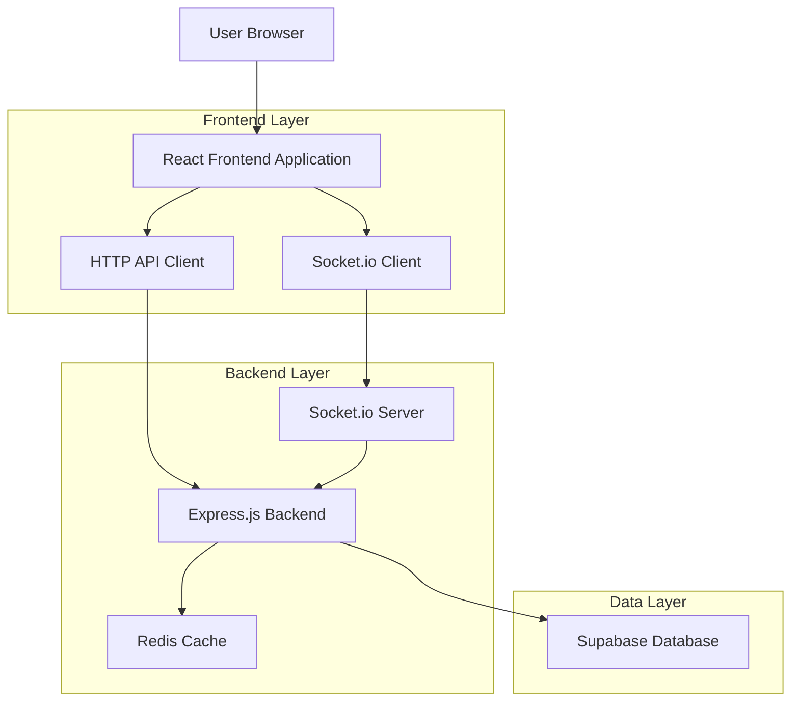
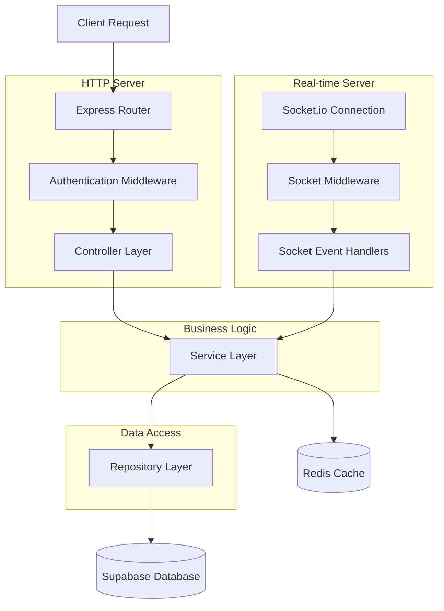
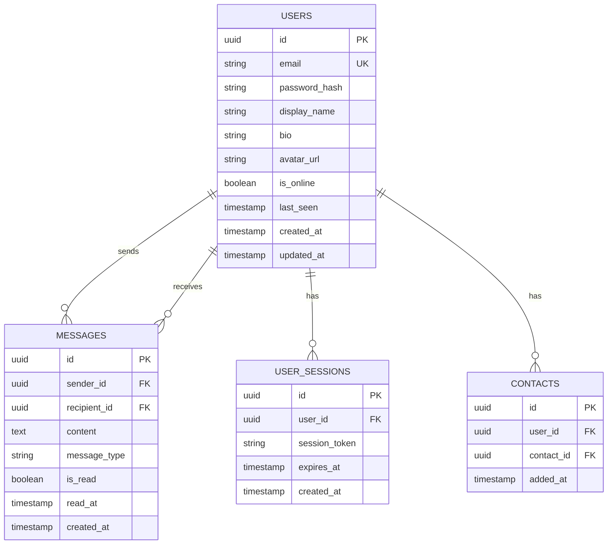

# Messaging Application - Technical Architecture Document

## 1. Architecture Design



## 2. Technology Description
- Frontend: React@18 + TypeScript@5 + Tailwind CSS@3 + Vite@5 + Socket.io-client@4
- Backend: Node.js@20 + Express@4 + TypeScript@5 + Socket.io@4
- Database: Supabase (PostgreSQL)
- Cache: Redis@7 (for session management and real-time features)
- Authentication: Supabase Auth

## 3. Route Definitions
| Route | Purpose |
|-------|----------|
| / | Redirect to /login or /dashboard based on auth status |
| /login | User authentication and registration |
| /dashboard | Main chat dashboard with contact list and recent conversations |
| /chat/:userId | Individual chat room interface |
| /profile | User profile settings and account management |
| /forgot-password | Password recovery interface |

## 4. API Definitions

### 4.1 Core API

**User Authentication**
```
POST /api/auth/register
```
Request:
| Param Name | Param Type | isRequired | Description |
|------------|------------|------------|-------------|
| email | string | true | User email address |
| password | string | true | User password (min 8 characters) |
| displayName | string | true | User display name |

Response:
| Param Name | Param Type | Description |
|------------|------------|-------------|
| success | boolean | Registration status |
| user | object | User profile data |
| token | string | JWT authentication token |

```
POST /api/auth/login
```
Request:
| Param Name | Param Type | isRequired | Description |
|------------|------------|------------|-------------|
| email | string | true | User email address |
| password | string | true | User password |

Response:
| Param Name | Param Type | Description |
|------------|------------|-------------|
| success | boolean | Login status |
| user | object | User profile data |
| token | string | JWT authentication token |

**Message Management**
```
GET /api/messages/:userId
```
Request:
| Param Name | Param Type | isRequired | Description |
|------------|------------|------------|-------------|
| userId | string | true | Target user ID for conversation |
| page | number | false | Pagination page number |
| limit | number | false | Messages per page (default: 50) |

Response:
| Param Name | Param Type | Description |
|------------|------------|-------------|
| messages | array | Array of message objects |
| hasMore | boolean | Whether more messages exist |

```
POST /api/messages
```
Request:
| Param Name | Param Type | isRequired | Description |
|------------|------------|------------|-------------|
| recipientId | string | true | Message recipient user ID |
| content | string | true | Message text content |
| type | string | false | Message type (default: 'text') |

Response:
| Param Name | Param Type | Description |
|------------|------------|-------------|
| success | boolean | Message send status |
| message | object | Created message object |

**User Management**
```
GET /api/users/contacts
```
Response:
| Param Name | Param Type | Description |
|------------|------------|-------------|
| contacts | array | Array of user contact objects |

```
PUT /api/users/profile
```
Request:
| Param Name | Param Type | isRequired | Description |
|------------|------------|------------|-------------|
| displayName | string | false | Updated display name |
| bio | string | false | User bio/status message |
| avatar | string | false | Profile picture URL |

### 4.2 Real-time Events (Socket.io)

**Connection Events**
- `connect`: User connects to socket server
- `disconnect`: User disconnects from socket server
- `user_online`: Broadcast when user comes online
- `user_offline`: Broadcast when user goes offline

**Messaging Events**
- `send_message`: Client sends new message
- `receive_message`: Client receives new message
- `typing_start`: User starts typing
- `typing_stop`: User stops typing
- `message_read`: Message read receipt

## 5. Server Architecture Diagram



## 6. Data Model

### 6.1 Data Model Definition



### 6.2 Data Definition Language

**Users Table**
```sql
-- Create users table
CREATE TABLE users (
    id UUID PRIMARY KEY DEFAULT gen_random_uuid(),
    email VARCHAR(255) UNIQUE NOT NULL,
    password_hash VARCHAR(255) NOT NULL,
    display_name VARCHAR(100) NOT NULL,
    bio TEXT,
    avatar_url TEXT,
    is_online BOOLEAN DEFAULT false,
    last_seen TIMESTAMP WITH TIME ZONE DEFAULT NOW(),
    created_at TIMESTAMP WITH TIME ZONE DEFAULT NOW(),
    updated_at TIMESTAMP WITH TIME ZONE DEFAULT NOW()
);

-- Create indexes
CREATE INDEX idx_users_email ON users(email);
CREATE INDEX idx_users_is_online ON users(is_online);

-- Grant permissions
GRANT SELECT ON users TO anon;
GRANT ALL PRIVILEGES ON users TO authenticated;
```

**Messages Table**
```sql
-- Create messages table
CREATE TABLE messages (
    id UUID PRIMARY KEY DEFAULT gen_random_uuid(),
    sender_id UUID NOT NULL,
    recipient_id UUID NOT NULL,
    content TEXT NOT NULL,
    message_type VARCHAR(20) DEFAULT 'text',
    is_read BOOLEAN DEFAULT false,
    read_at TIMESTAMP WITH TIME ZONE,
    created_at TIMESTAMP WITH TIME ZONE DEFAULT NOW()
);

-- Create indexes
CREATE INDEX idx_messages_sender_recipient ON messages(sender_id, recipient_id);
CREATE INDEX idx_messages_created_at ON messages(created_at DESC);
CREATE INDEX idx_messages_is_read ON messages(is_read);

-- Grant permissions
GRANT SELECT ON messages TO anon;
GRANT ALL PRIVILEGES ON messages TO authenticated;
```

**User Sessions Table**
```sql
-- Create user_sessions table
CREATE TABLE user_sessions (
    id UUID PRIMARY KEY DEFAULT gen_random_uuid(),
    user_id UUID NOT NULL,
    session_token VARCHAR(255) UNIQUE NOT NULL,
    expires_at TIMESTAMP WITH TIME ZONE NOT NULL,
    created_at TIMESTAMP WITH TIME ZONE DEFAULT NOW()
);

-- Create indexes
CREATE INDEX idx_user_sessions_user_id ON user_sessions(user_id);
CREATE INDEX idx_user_sessions_token ON user_sessions(session_token);
CREATE INDEX idx_user_sessions_expires ON user_sessions(expires_at);

-- Grant permissions
GRANT ALL PRIVILEGES ON user_sessions TO authenticated;
```

**Contacts Table**
```sql
-- Create contacts table
CREATE TABLE contacts (
    id UUID PRIMARY KEY DEFAULT gen_random_uuid(),
    user_id UUID NOT NULL,
    contact_id UUID NOT NULL,
    added_at TIMESTAMP WITH TIME ZONE DEFAULT NOW(),
    UNIQUE(user_id, contact_id)
);

-- Create indexes
CREATE INDEX idx_contacts_user_id ON contacts(user_id);
CREATE INDEX idx_contacts_contact_id ON contacts(contact_id);

-- Grant permissions
GRANT SELECT ON contacts TO anon;
GRANT ALL PRIVILEGES ON contacts TO authenticated;
```

**Initial Data**
```sql
-- Insert sample users for testing
INSERT INTO users (email, password_hash, display_name, bio) VALUES
('demo@example.com', '$2b$10$example_hash', 'Demo User', 'Welcome to the messaging app!'),
('test@example.com', '$2b$10$example_hash', 'Test User', 'Testing the application');
```