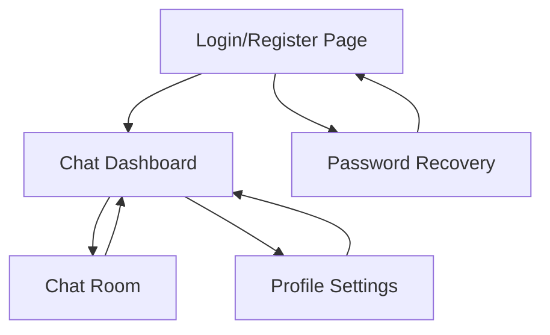

# Messaging Application - Product Requirements Document

## 1. Product Overview
A real-time messaging application that enables users to communicate instantly through text messages with features like user authentication, message history, and online status indicators.

The application solves the need for seamless communication between users in real-time, targeting individuals and small teams who require instant messaging capabilities with a modern, responsive interface.

## 2. Core Features

### 2.1 User Roles
| Role | Registration Method | Core Permissions |
|------|---------------------|------------------|
| Registered User | Email and password registration | Can send/receive messages, view message history, update profile |
| Guest User | No registration required | Can view public chat rooms (read-only) |

### 2.2 Feature Module
Our messaging application consists of the following main pages:
1. **Login/Register page**: user authentication, account creation, password recovery.
2. **Chat Dashboard**: contact list, recent conversations, online status indicators.
3. **Chat Room**: real-time messaging interface, message history, typing indicators.
4. **Profile Settings**: user profile management, notification preferences, account settings.

### 2.3 Page Details
| Page Name | Module Name | Feature description |
|-----------|-------------|---------------------|
| Login/Register | Authentication Form | User login with email/password, new user registration, password reset functionality |
| Login/Register | Social Login | Optional Google/GitHub OAuth integration for quick access |
| Chat Dashboard | Contact List | Display all contacts with online/offline status, search contacts |
| Chat Dashboard | Recent Conversations | Show recent chat history with last message preview and timestamps |
| Chat Dashboard | User Status | Display current user's online status with ability to change status |
| Chat Room | Message Interface | Send/receive text messages in real-time, message timestamps |
| Chat Room | Message History | Load and display previous conversation history with pagination |
| Chat Room | Typing Indicators | Show when other users are typing in real-time |
| Chat Room | Message Status | Display message delivery and read status indicators |
| Profile Settings | User Profile | Edit display name, profile picture, bio information |
| Profile Settings | Notification Settings | Configure message notifications, sound alerts, desktop notifications |
| Profile Settings | Account Management | Change password, delete account, privacy settings |

## 3. Core Process
**User Registration and Login Flow:**
New users register with email and password, receive email verification, then access the chat dashboard. Existing users log in directly to access their conversations.

**Messaging Flow:**
Users select a contact from the dashboard, enter a chat room, send messages in real-time, view message history, and see typing indicators and online status of other participants.

**Profile Management Flow:**
Users access profile settings from the dashboard, update personal information, configure notification preferences, and manage account security settings.

## 4. User Interface Design
### 4.1 Design Style
- **Primary Colors**: Blue (#007bff) for primary actions, Gray (#6c757d) for secondary elements
- **Secondary Colors**: Green (#28a745) for online status, Red (#dc3545) for offline/error states
- **Button Style**: Rounded corners (8px border-radius), subtle shadows, hover effects
- **Font**: Inter or system fonts, 14px base size, 16px for headings
- **Layout Style**: Clean card-based design, left sidebar navigation, responsive grid system
- **Icons**: Feather icons or similar minimalist icon set, consistent sizing

### 4.2 Page Design Overview
| Page Name | Module Name | UI Elements |
|-----------|-------------|-------------|
| Login/Register | Authentication Form | Centered card layout, blue primary buttons, clean input fields with floating labels |
| Chat Dashboard | Contact List | Left sidebar with user avatars, online status dots (green/gray), search bar at top |
| Chat Dashboard | Recent Conversations | List view with user avatars, message previews, timestamps aligned right |
| Chat Room | Message Interface | Chat bubbles (blue for sent, gray for received), input field at bottom, send button |
| Chat Room | Message History | Scrollable message area, date separators, loading spinner for pagination |
| Profile Settings | Settings Panel | Tabbed interface, form inputs with labels, save/cancel buttons |

### 4.3 Responsiveness
Mobile-first responsive design with breakpoints at 768px (tablet) and 1024px (desktop). Touch-optimized interface with larger tap targets on mobile devices, collapsible sidebar navigation for smaller screens.